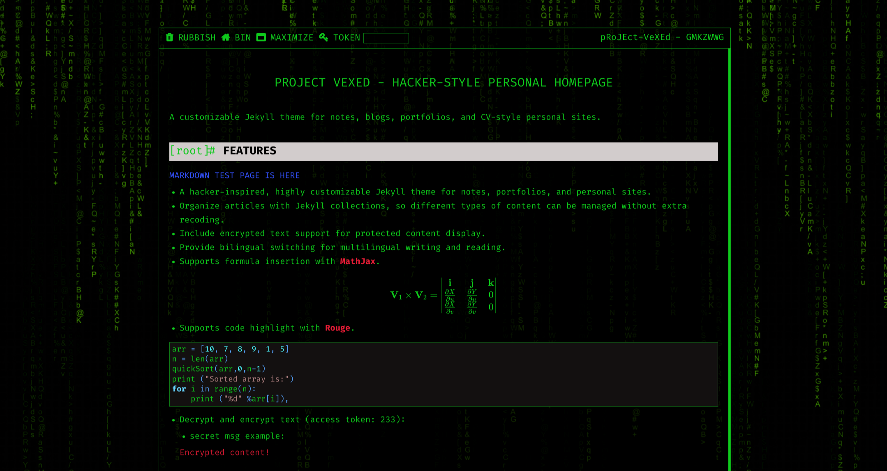
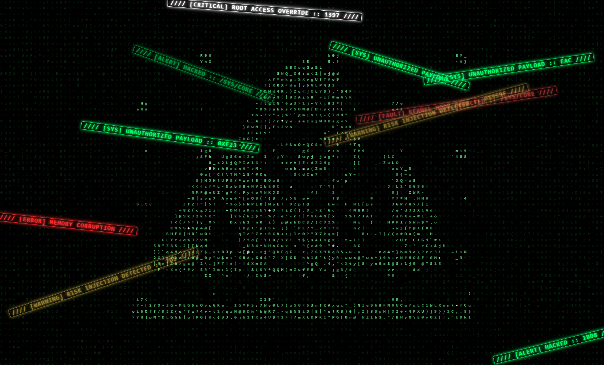

[![Forks][forks-shield]][forks-url]
[![Stars][stars-shield]][stars-url]
[![Issues][issues-shield]][issues-url]
[![MIT License][license-shield]][license-url]

# pRoJEct-VeXEd

A customizable Jekyll theme for notes, blogs, portfolios, and CV-style personal sites.

Demo: [View Demo](https://akiritsu.github.io/pRoJEct-VeXEd/)

## Features

- A hacker-inspired, highly customizable Jekyll theme for notes, portfolios, and personal sites.
- Organize articles with Jekyll collections, so different types of content can be managed without extra recoding.
- Include encrypted text support for protected content display.
- Provide bilingual switching for multilingual writing and reading.




## Quick Start

### Requirements

- Ruby
- Bundler

Install Bundler if needed:

```bash
gem install bundler
````

Install project dependencies:

```bash
bundle install
```

### Run locally

```bash
bundle exec jekyll serve
```

Then open `http://127.0.0.1:4000`.

## Installation

Clone your fork:

```bash
git clone https://github.com/<YOUR_USERNAME>/<YOUR_REPOSITORY>.git
cd <YOUR_REPOSITORY>
```

## Customization

### Site config

Edit `_config.yml` to update your site information and settings.

### Collections

Store your content under `./collections/` and register each collection in `_config.yml`.

Example:

```yaml
collections:
  notes:
    output: true
    permalink: /:collection/:title/
    sort_by: date

  portfolio:
    output: true
    permalink: /:collection/:title/
    order:
      - portfolio3.md
      - portfolio2.md
      - portfolio1.md

  album:
    output: true
    permalink: /:collection/:title/
    sort_by: date
```

All collection entries are available from the Archive page.

### Writing

Remove the sample collections under `./collections/`, then start adding your own content.

### Comments

Create a Disqus account and set `disqus_username` in `_config.yml`.

### Front Matter

Jekyll pages can be customized with Front Matter.

Reference:
[https://jekyllrb.com/docs/front-matter/](https://jekyllrb.com/docs/front-matter/)

## Contributing

Contributions are welcome.

1. Fork the repository
2. Create a feature branch
3. Commit your changes
4. Push the branch
5. Open a pull request

## License

Distributed under the MIT License. See `LICENSE` for details.

[forks-shield]: https://img.shields.io/github/forks/akiritsu/pRoJEct-VeXEd.svg?style=flat-square
[forks-url]: https://github.com/akiritsu/pRoJEct-VeXEd/network/members
[stars-shield]: https://img.shields.io/github/stars/akiritsu/pRoJEct-VeXEd.svg?style=flat-square
[stars-url]: https://github.com/akiritsu/pRoJEct-VeXEd/stargazers
[issues-shield]: https://img.shields.io/github/issues/akiritsu/pRoJEct-VeXEd.svg?style=flat-square
[issues-url]: https://github.com/akiritsu/pRoJEct-VeXEd/issues
[license-shield]: https://img.shields.io/github/license/akiritsu/pRoJEct-VeXEd.svg?style=flat-square
[license-url]: https://github.com/akiritsu/pRoJEct-VeXEd/blob/master/LICENSE.txt

